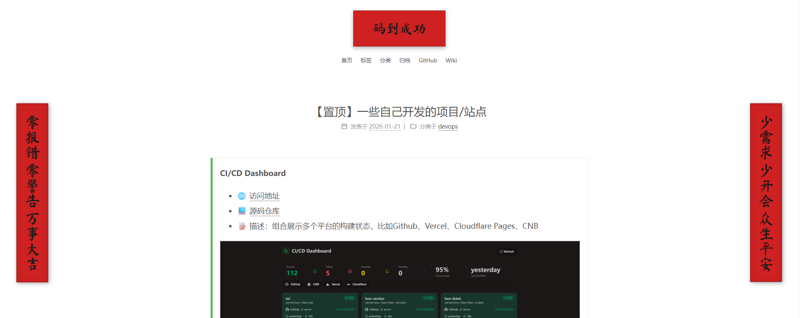

# 给网站加上赛博春联

## 使用
```html
<script>
  window.cyberCoupletConfig = {
    leftText: "上联写在这里",
    rightText: "下联写在这里",
    topText: "横批"
  };
</script>
<script src="https://cdn.jsdelivr.net/gh/dongfg/cyber-couplet@master/couplet.js"></script>
```

## 效果
